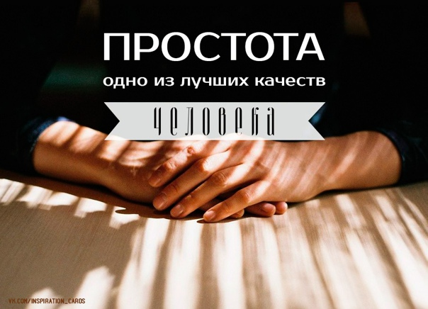

# Просто текст

Простотекст делится на:
1. Простой
2. Очень простой
3. Сверх простой

Также он может быть:
* Попроще
* Совсем простой

[Простота](https://ru.wiktionary.org/wiki/%D0%BF%D1%80%D0%BE%D1%81%D1%82%D0%BE%D1%82%D0%B0) может быть разной.

::: info
**Она может быть толстой**
:::

::: danger
*Она может быть кривой*
:::

